# Relatório de Observabilidade do .NET com OpenTelemetry

## Introdução

Este relatório documenta a implementação de observabilidade em uma aplicação .NET utilizando OpenTelemetry, com integração ao Prometheus para coleta de métricas, Jaeger para rastreamento distribuído e Grafana para visualização. Feita para o autoestudo ponderado da semana 7.

## Tecnologia e Conceitos Aprendidos

Observabilidade é a capacidade de entender o estado interno de um sistema a partir de seus outputs externos. Através dos três pilares da observabilidade - logs, métricas e rastreamentos - pude monitorar e analisar a telemetria de aplicações para identificar e solucionar problemas.

OpenTelemetry é um conjunto de APIs, bibliotecas e ferramentas que permitem a instrumentação, geração e coleta de dados de telemetria de forma eficiente. Ele suporta a integração com várias plataformas e ferramentas de observabilidade, facilitando a análise e o monitoramento de aplicações.

## Aprendizados e Experiência com as Ferramentas de Observabilidade

 Aqui estão os principais aprendizados e experiências adquiridas com cada ferramenta:

### Prometheus

Prometheus é uma ferramenta de monitoramento e alerta para aplicações distribuídas. Através da configuração e uso do Prometheus, aprendi como:

- **Consultar e analisar métricas:** Aprendi a usar a linguagem de consulta do Prometheus para extrair insights das métricas coletadas, o que é crucial para entender o comportamento da aplicação e identificar tendências ou problemas.

### Jaeger

Jaeger é uma ferramenta para rastreamento distribuído, permitindo analisar e otimizar a performance de aplicações distribuídas. Com Jaeger, aprendi a:

- **Visualizar rastreamentos distribuídos:** Compreendi como rastreamentos distribuídos fornecem visibilidade sobre o fluxo de solicitações através dos diversos serviços que compõem uma aplicação, permitindo identificar gargalos de performance e falhas.

### Grafana

Grafana é uma plataforma de análise e visualização de dados que suporta uma ampla gama de fontes de dados, incluindo Prometheus. Através do Grafana, consegui:

- **Criar dashboards personalizados:** Aprendi a criar dashboards interativos e personalizados para visualizar as métricas e rastreamentos de maneira compreensível, facilitando a interpretação dos dados coletados.
- **Explorar e compartilhar insights:** Vi como o Grafana facilita a exploração dos dados de telemetria e o compartilhamento de insights com a equipe, promovendo uma cultura de observabilidade e melhoria contínua.

### Implementação

A implementação envolveu a criação de um projeto .NET simples, com configuração de métricas personalizadas e instrumentação para observabilidade utilizando OpenTelemetry.

### Configuração do OpenTelemetry

Foram referenciados os pacotes do OpenTelemetry necessários e configurados no projeto para coletar e exportar dados de telemetria.
Fiz essa parte colando o codigo no projeto.

### Exportadores

Configurei exportadores para enviar os dados coletados para sistemas de observabilidade externos:

- **Prometheus** para métricas
- **Jaeger** para rastreamento
- **Grafana** para visualização

## Coleta de Métricas com Prometheus

Prometheus foi configurado para coletar métricas expostas pelo aplicativo, demonstrando como configurar e coletar métricas.

## Visualização com Grafana

Grafana foi usado para conectar ao Prometheus e criar dashboards, permitindo visualizar as métricas coletadas.

## Rastreamento Distribuído com Jaeger

Jaeger foi configurado para visualizar rastreamentos distribuídos, facilitando a compreensão do fluxo de solicitações e a detecção de problemas.

## Screenshots

Abaixo estão os prints demonstrando o código em execução e as visualizações geradas no Prometheus, Jaeger e Grafana.

### Criação do projeto
Rotas definidas no swagger:
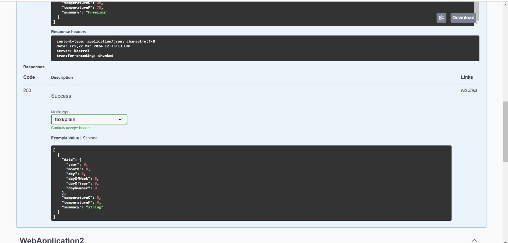
   

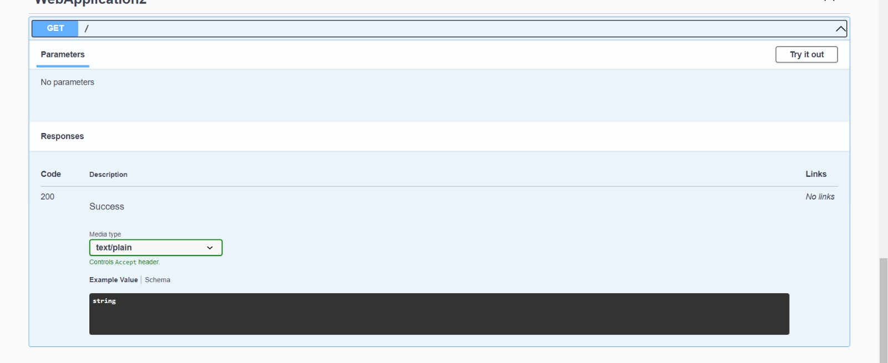
   

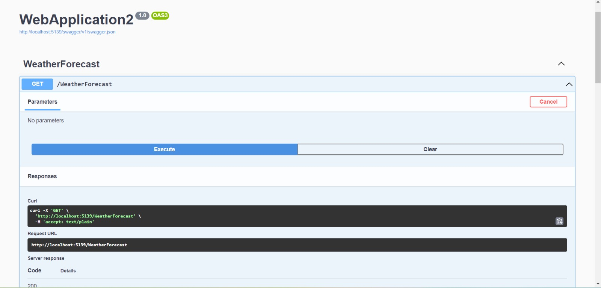
   

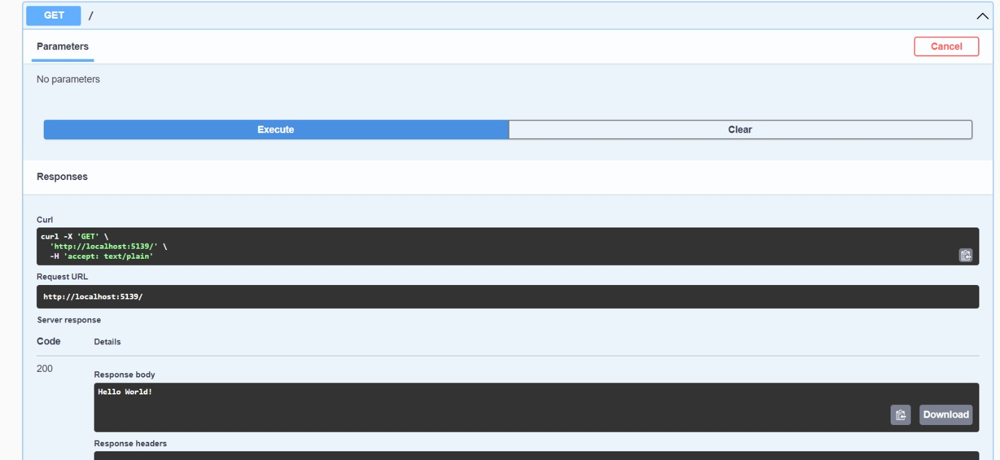
Aqui é possivel ver o endpoint "/" que foi definido pelo autoestudo.
   
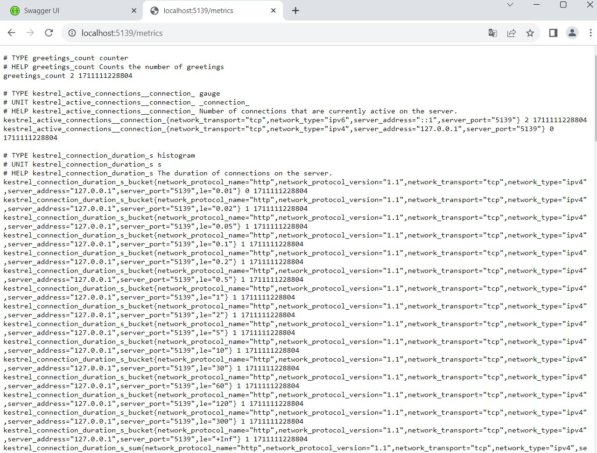
Aqui é o endopoint "/metrics"
   

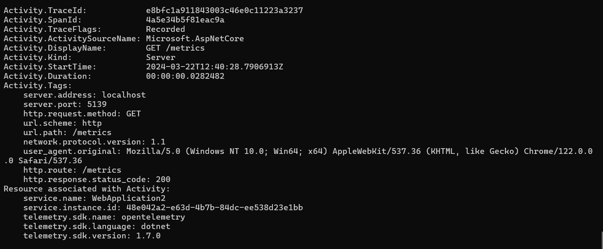
Nessa parte é possivel acessar os rastreamento do console.
   

### Prometheus
   

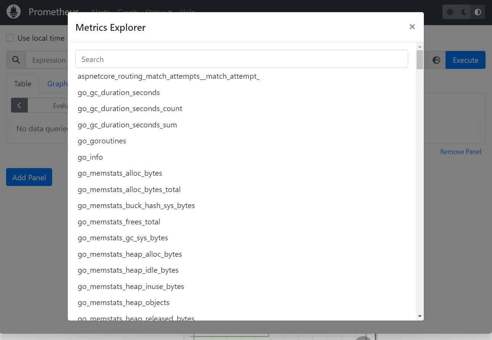
Apos configurar o Prometheus e escolher as métricas o  grafico é gerado.
   

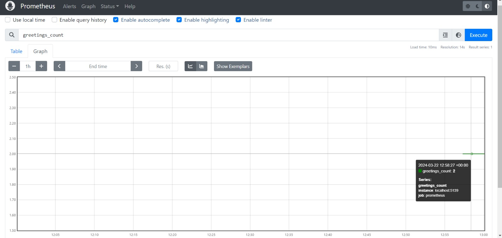
Grafo de valores da métrica de greetins_count 
   

### Grafana
Imagens mostrando o grafana rodando
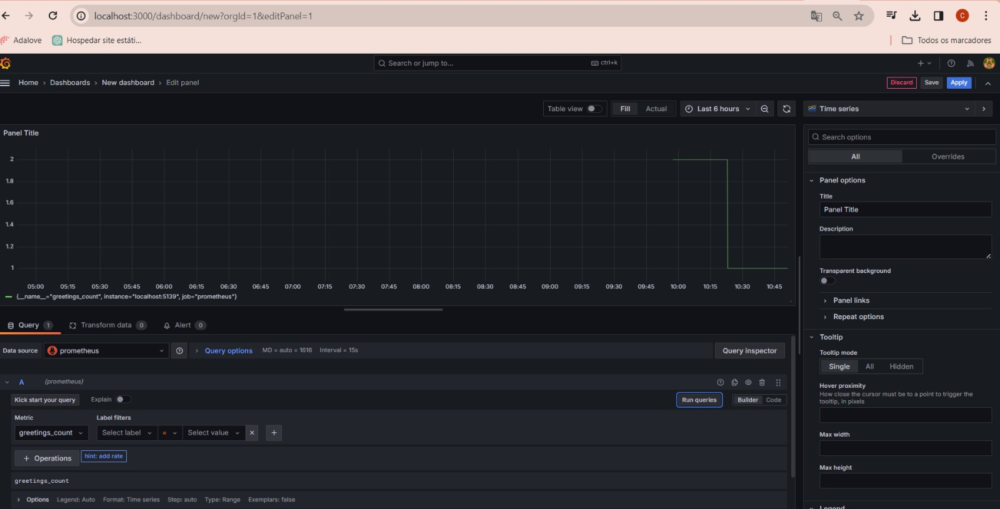
   

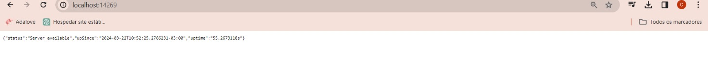
   

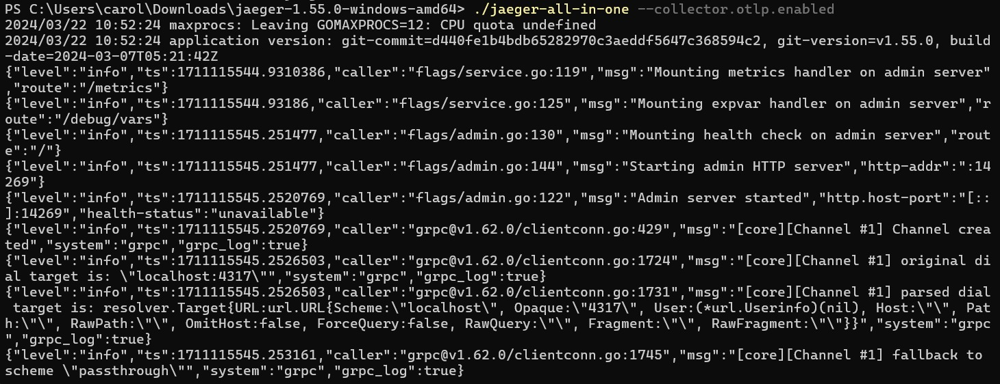
   

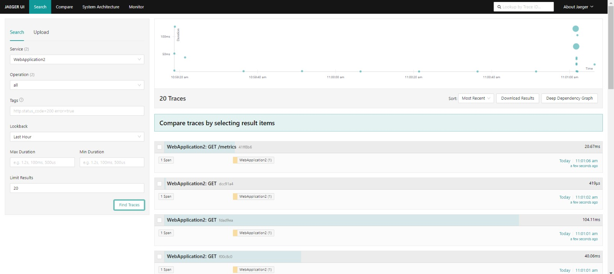
   

Apos a adição de NestedGreeting:
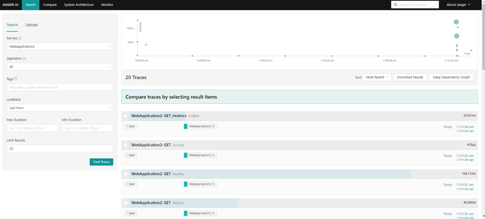

